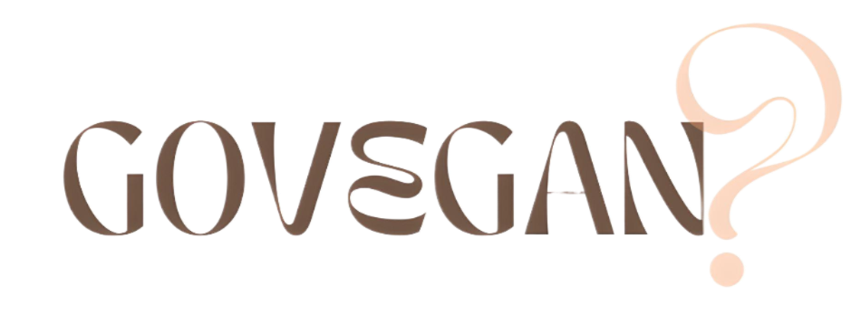

# Go vegan?



## Índice

1. [🥦 Descripción](#descripcion)
2. [🍑 Objetivo](#objetivo)
3. [🥑 Visualización](#visualizacion)
4. [🌶️ Próximos pasos](#pasos)
5. [🍍 Estructura](#estructura)


## 🥦 Descripción:<a name="descripcion"/>

Proyecto de ETL y visualización como Data Analyst en Ironhack. 

Con este proyecto se propone la práctica del proceso de análisis de datos. Para ello, hemos creado una web interactiva mediante la que el usuario puede medir su impacto ecológico según su alimentación, comparar alternativas a su dieta y obtener recomendaciones según preferencias.

En el siguiente enlace se da acceso a la web:

[Website Go vegan?](https://nereariveiro-go-vegan--streamlitmain-ky4jxb.streamlit.app/)

## 🍑 Objetivo:<a name="objetivo"/>

El cambio climático es una preocupación constante en el panorama actual, vemos cómo las consecuencias marcan nuestro día a día y empieza a sonar la cuenta atrás. Pero, ¿y si podemos aportar a la lucha con algo tan costumbrista como nuestra dieta?. Mucha gente se hace preguntas al aire sobre la viabilidad de un mundo con una alimentanción vegetal, la calidad de la proteína verde versus la animal o si las plantaciones tienen tanto impacto como las granjas. Así, nos hemos planteado las siguientes duadas:

- ¿La dieta influye en nuestro impacto?
- ¿Qué alimentos son más dañinos para el medioambiente?
- ¿Hay forma de medir cuánto afectamos al ecosistema por nuestro consumo?
- ¿Dependiendo del origen de nuestros alimentos varía la contaminación?
- ¿Cuáles son los alimentos que más recursos gastan?


## 🥑 Visualización:<a name="visualizacion"/>

Para el desarrollo de la web hemos usado Streamlit, en ella el usuario puede personalizar la búsqueda de información a su criterio y se le da paso a que genere sus propias conclusiones. 

Aquí podemos ver una pequeña demostración de uso:


https://github.com/NereaRiveiro/Go-vegan-/assets/126264593/9dd26ed7-0c1b-4eef-b260-7150e27e14fc


## 🌶️ Próximos pasos:<a name='pasos'/>

Este primer prototipo ha generado la ambición necesaria para continuar el proyecto. El camino lleva a:

- Completar la base de datos con más alimentos.
- Añadir más filtros personalizados para analizar el consumo del usuario.
- Continuar la sección de recomendaciones con datos de tal forma que según parámetros genere un principio de cambio de dieta.
- Seguir perfeccionando la web para que quede limpia y bonita.


## 🍍 Estructura:<a name="estructura"/>

```
Proyecto 
|__ DATA/                         # contiene datos y los csv limpios
|
|__ IMAGES/                       # contiene imagénes referentes al proyecto    
|
|___ NOTEBOOK/                    # notebooks de limpieza y visualizaciones
|
|__ SHOW                          # vídeo y slides de presentación
|
|__ STREAMLIT                     # código de la web y sus componentes
|
|__ .gitignore                    # archivo gitignore     
|
|__ README.md                     # información del proyecto
```
